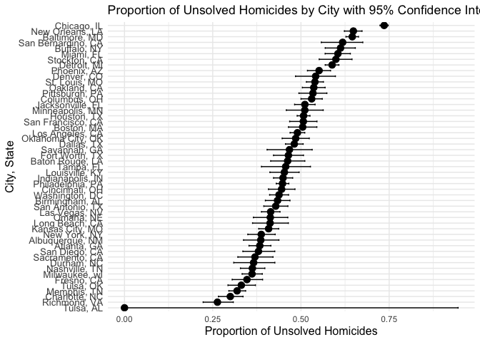

p8105_hw5_kw3014
================

``` r
library(tidyverse)
```

    ## ── Attaching core tidyverse packages ──────────────────────── tidyverse 2.0.0 ──
    ## ✔ dplyr     1.1.4     ✔ readr     2.1.5
    ## ✔ forcats   1.0.0     ✔ stringr   1.5.1
    ## ✔ ggplot2   3.5.1     ✔ tibble    3.2.1
    ## ✔ lubridate 1.9.3     ✔ tidyr     1.3.1
    ## ✔ purrr     1.0.2     
    ## ── Conflicts ────────────────────────────────────────── tidyverse_conflicts() ──
    ## ✖ dplyr::filter() masks stats::filter()
    ## ✖ dplyr::lag()    masks stats::lag()
    ## ℹ Use the conflicted package (<http://conflicted.r-lib.org/>) to force all conflicts to become errors

``` r
library(broom)
library(dplyr)
library(purrr)
library(ggplot2)
```

## Problem 1

## Problem 2

## Problem 3

``` r
# Read the data set
homicide_data <- read.csv("~/Desktop/Fall2024/DS/DS Code/p8105_hw5_kw3104/homicide-data.csv")

homicide_summary <- homicide_data %>%
  # Create city_state variable
  mutate(city_state = paste(city, state, sep = ", ")) %>%
  # Add an unsolved column based on dispositions
  mutate(unsolved = disposition %in% c("Closed without arrest", "Open/No arrest")) %>%
  # Group by city_state and summarize the data
  group_by(city_state) %>%
  summarise(
    total_homicides = n(),
    unsolved_homicides = sum(unsolved, na.rm = TRUE),
    .groups = "drop"  # Avoids grouped structure in output
  )
```

the raw data `homicide-data.csv` has 52179 observations and 12 variables
(uid, reported_date, victim last name, victim first name, victim’s race,
victim’s age, victim’s sex, city, state, latitude, longitude,
disposition )

the cleaned up dataset `homicide_summary` has 51 observations (each
states) and 3 variables (city_state, total homisides, and unsolved
homisides)

``` r
# Perform analysis for Baltimore, MD
result <- homicide_data %>%
  filter(city == "Baltimore", state == "MD") %>%
  summarise(
    total_homicides = n(),
    unsolved_homicides = sum(disposition %in% c("Closed without arrest", "Open/No arrest"))
  ) %>%
  rowwise() %>% # Ensure the data is treated row-wise for prop.test
  mutate(
    prop_test = list(prop.test(x = unsolved_homicides, n = total_homicides, conf.level = 0.95))
  ) %>%
  mutate(
    tidy_result = list(broom::tidy(prop_test))
  ) %>%
  unnest(tidy_result)

# Extract the proportion and confidence intervals
estimated_proportion <- result$estimate
conf_interval_lower <- result$conf.low
conf_interval_upper <- result$conf.high

# Print the results
list(
  estimated_proportion = estimated_proportion,
  confidence_interval = c(conf_interval_lower, conf_interval_upper)
)
```

    ## $estimated_proportion
    ##         p 
    ## 0.6455607 
    ## 
    ## $confidence_interval
    ## [1] 0.6275625 0.6631599

in total, there are 2827 homicides, 1825 unsolved cases. p-value is
6.461911e-5 estimated proportion is 0.6455607 95% confidence interval
(0.6275625, 0.6631599)

``` r
# Perform the analysis
city_proportion_summary <- homicide_data %>%
  # Create city_state variable
  mutate(city_state = paste(city, state, sep = ", ")) %>%
  # Add an unsolved column based on dispositions
  mutate(unsolved = disposition %in% c("Closed without arrest", "Open/No arrest")) %>%
  # Group by city_state and calculate summary statistics
  group_by(city_state) %>%
  summarise(
    total_homicides = n(),
    unsolved_homicides = sum(unsolved, na.rm = TRUE),
    .groups = "drop"  # Drop grouped structure after summarise
  ) %>%
  # Perform prop.test for each city using map
  mutate(
    prop_test = map2(unsolved_homicides, total_homicides, ~prop.test(x = .x, n = .y, conf.level = 0.95))
  ) %>%
  # Tidy up the prop.test results
  mutate(
    tidy_result = map(prop_test, broom::tidy)
  ) %>%
  unnest(tidy_result) %>%
  # Select relevant columns for output
  select(city_state, estimate, conf.low, conf.high)
```

    ## Warning: There was 1 warning in `mutate()`.
    ## ℹ In argument: `prop_test = map2(...)`.
    ## Caused by warning in `prop.test()`:
    ## ! Chi-squared approximation may be incorrect

`city_proportion_summary` has 51 observations and 4 variables
(city_state, estimate, conf.low, conf.high) Chicago, IL has the highest
proportion of unsolved homicides (0.7358627) and Tulsa, AL has the least
proportion of unsolved homicides (0).

``` r
# Sort the data by estimated proportion
city_proportion_summary <- city_proportion_summary %>%
  arrange(desc(estimate))

# Create the plot
ggplot(city_proportion_summary, aes(x = estimate, y = reorder(city_state, estimate))) +
  geom_point(size = 3) +  # Points for the estimates
  geom_errorbarh(aes(xmin = conf.low, xmax = conf.high), height = 0.3) +  # Error bars
  labs(
    title = "Proportion of Unsolved Homicides by City with 95% Confidence Intervals",
    x = "Proportion of Unsolved Homicides",
    y = "City, State"
  ) +
  theme_minimal() +
  theme(
    axis.text.y = element_text(size = 10),  # Adjust y-axis text size
    axis.title.x = element_text(size = 12),
    axis.title.y = element_text(size = 12)
  )
```

<!-- -->
This chart shows the percentage of unsolved homicides for different
cities, with the error bars showing the range of uncertainty. Cities
like Chicago, Baltimore, and New Orleans have the most unsolved cases,
while cities like Tulsa and Richmond have the least.
