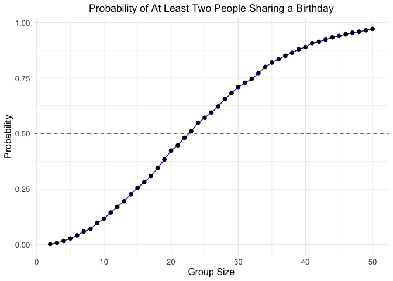
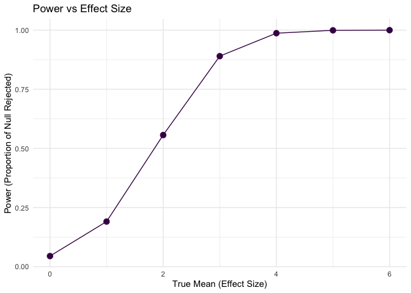
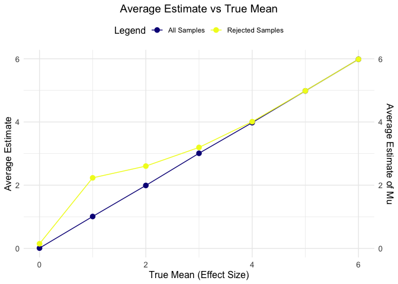

p8105_hw5_kw3014
================

``` r
library(tidyverse)
```

    ## ── Attaching core tidyverse packages ──────────────────────── tidyverse 2.0.0 ──
    ## ✔ dplyr     1.1.4     ✔ readr     2.1.5
    ## ✔ forcats   1.0.0     ✔ stringr   1.5.1
    ## ✔ ggplot2   3.5.1     ✔ tibble    3.2.1
    ## ✔ lubridate 1.9.3     ✔ tidyr     1.3.1
    ## ✔ purrr     1.0.2     
    ## ── Conflicts ────────────────────────────────────────── tidyverse_conflicts() ──
    ## ✖ dplyr::filter() masks stats::filter()
    ## ✖ dplyr::lag()    masks stats::lag()
    ## ℹ Use the conflicted package (<http://conflicted.r-lib.org/>) to force all conflicts to become errors

``` r
library(broom)
library(dplyr)
library(purrr)
library(ggplot2)
library(viridis)
```

    ## Loading required package: viridisLite

## Problem 1

``` r
# Function to simulate if at least two people share a birthday
simulate_shared_birthday <- function(n) {
  birthdays <- sample(1:365, size = n, replace = TRUE)
  return(any(duplicated(birthdays)))
}

# Group sizes between 2 and 50
group_sizes <- 2:50

# Initialize a vector to store probabilities
probabilities <- numeric(length(group_sizes))

# Run the simulation using a for loop
trials <- 10000
for (i in seq_along(group_sizes)) {
  n <- group_sizes[i]
  shared_count <- 0
  for (j in 1:trials) {
    if (simulate_shared_birthday(n)) {
      shared_count <- shared_count + 1
    }
  }
  probabilities[i] <- shared_count / trials
}

# Create a dataframe for plotting
plot_data <- data.frame(GroupSize = group_sizes, Probability = probabilities)

# Plot the results
library(ggplot2)
ggplot(plot_data, aes(x = GroupSize, y = Probability)) +
  geom_line(color = "blue") +
  geom_point(size = 2) +
  geom_hline(yintercept = 0.5, linetype = "dashed", color = "red") +
  labs(
    title = "Probability of At Least Two People Sharing a Birthday",
    x = "Group Size",
    y = "Probability"
  ) +
  theme_minimal() +
  theme(
    plot.title = element_text(hjust = 0.5),
    axis.text = element_text(size = 10),
    axis.title = element_text(size = 12)
  )
```

<!-- -->

this plot shows the probability of at least two people sharing a
birthday as a function of the group size. The probability rises sharply
as the group size increases, exceeding 50% around a group size of 23.

## Problem 2

``` r
# Simulation parameters
n <- 30           # Sample size
sigma <- 5        # Standard deviation
num_simulations <- 5000  # Number of datasets
alpha <- 0.05     # Significance level
mu_values <- c(0, 1, 2, 3, 4, 5, 6)  # True mean values

# Initialize results storage
results <- data.frame()

# Loop over different true means (mu)
set.seed(123)  # For reproducibility
for (mu in mu_values) {
  # Simulate datasets for each true mean
  for (i in 1:num_simulations) {
    # Generate random data
    x <- rnorm(n, mean = mu, sd = sigma)
    
    # Perform a one-sample t-test
    test_result <- t.test(x, mu = 0)
    
    # Extract results using broom::tidy
    tidy_result <- broom::tidy(test_result)
    results <- rbind(results, data.frame(
      true_mu = mu,
      estimate = tidy_result$estimate,
      p_value = tidy_result$p.value
    ))
  }
}

# Calculate power for each true mean (proportion of rejected nulls)
power_summary <- results %>%
  group_by(true_mu) %>%
  summarise(
    power = mean(p_value < alpha),
    avg_estimate = mean(estimate),
    avg_estimate_rejected = mean(estimate[p_value < alpha], na.rm = TRUE)
  )
```

in `tidy_result`, estimate is 6.20512 and p-value is 3.067096e-08

``` r
# Plot 1: Power vs True Mean
ggplot(power_summary, aes(x = true_mu, y = power)) +
  geom_line(color = viridis(1)) +
  geom_point(size = 3, color = viridis(1)) +
  labs(
    title = "Power vs Effect Size",
    x = "True Mean (Effect Size)",
    y = "Power (Proportion of Null Rejected)"
  ) +
  theme_minimal()
```

<!-- -->
This plot shows that as the true mean increases, the power of the t-test
rises, indicating a higher probability of correctly rejecting the null
hypothesis. The power plateaus near 1 for large effect sizes
highlighting that larger effect sizes make detecting differences much
easier.

``` r
# Plot 2: Average Estimate vs True Mean
ggplot(power_summary, aes(x = true_mu)) +
  geom_line(aes(y = avg_estimate, color = "All Samples")) +
  geom_point(aes(y = avg_estimate, color = "All Samples"), size = 3, shape = 16) +
  geom_line(aes(y = avg_estimate_rejected, color = "Rejected Samples")) +
  geom_point(aes(y = avg_estimate_rejected, color = "Rejected Samples"), size = 3, shape = 16) +
  scale_color_viridis_d(option = "C") +  # Apply discrete viridis colors
  labs(
    title = "Average Estimate vs True Mean",
    x = "True Mean (Effect Size)",
    y = "Average Estimate",
    color = "Legend"
  ) +
  scale_y_continuous(sec.axis = dup_axis(name = "Average Estimate of Mu")) +
  theme_minimal() +
  theme(
    legend.position = "top",
    legend.title = element_text(size = 12),
    axis.text = element_text(size = 10),
    axis.title = element_text(size = 12),
    plot.title = element_text(hjust = 0.5, size = 14)
  )
```

<!-- -->
This plot compares the average estimate for all samples and for samples
where the null hypothesis was rejected against the true mean. The
estimates for rejected samples are slightly biased upward for smaller
effect sizes due to the selection of significant results, but align
closely with the true mean as the effect size increases.

## Problem 3

``` r
# Read the data set
homicide_data <- read.csv("~/Desktop/Fall2024/DS/DS Code/p8105_hw5_kw3104/homicide-data.csv")

homicide_summary <- homicide_data %>%
  # Create city_state variable
  mutate(city_state = paste(city, state, sep = ", ")) %>%
  # Add an unsolved column based on dispositions
  mutate(unsolved = disposition %in% c("Closed without arrest", "Open/No arrest")) %>%
  # Group by city_state and summarize the data
  group_by(city_state) %>%
  summarise(
    total_homicides = n(),
    unsolved_homicides = sum(unsolved, na.rm = TRUE),
    .groups = "drop"  # Avoids grouped structure in output
  )
```

the raw data `homicide-data.csv` has 52179 observations and 12 variables
(uid, reported_date, victim last name, victim first name, victim’s race,
victim’s age, victim’s sex, city, state, latitude, longitude,
disposition )

the cleaned up dataset `homicide_summary` has 51 observations (each
states) and 3 variables (city_state, total homisides, and unsolved
homisides)

``` r
# Perform analysis for Baltimore, MD
result <- homicide_data %>%
  filter(city == "Baltimore", state == "MD") %>%
  summarise(
    total_homicides = n(),
    unsolved_homicides = sum(disposition %in% c("Closed without arrest", "Open/No arrest"))
  ) %>%
  rowwise() %>% # Ensure the data is treated row-wise for prop.test
  mutate(
    prop_test = list(prop.test(x = unsolved_homicides, n = total_homicides, conf.level = 0.95))
  ) %>%
  mutate(
    tidy_result = list(broom::tidy(prop_test))
  ) %>%
  unnest(tidy_result)

# Extract the proportion and confidence intervals
estimated_proportion <- result$estimate
conf_interval_lower <- result$conf.low
conf_interval_upper <- result$conf.high

# Print the results
list(
  estimated_proportion = estimated_proportion,
  confidence_interval = c(conf_interval_lower, conf_interval_upper)
)
```

    ## $estimated_proportion
    ##         p 
    ## 0.6455607 
    ## 
    ## $confidence_interval
    ## [1] 0.6275625 0.6631599

in total, there are 2827 homicides, 1825 unsolved cases. p-value is
6.461911e-5 estimated proportion is 0.6455607 95% confidence interval
(0.6275625, 0.6631599)

``` r
# Perform the analysis
city_proportion_summary <- homicide_data %>%
  # Create city_state variable
  mutate(city_state = paste(city, state, sep = ", ")) %>%
  # Add an unsolved column based on dispositions
  mutate(unsolved = disposition %in% c("Closed without arrest", "Open/No arrest")) %>%
  # Group by city_state and calculate summary statistics
  group_by(city_state) %>%
  summarise(
    total_homicides = n(),
    unsolved_homicides = sum(unsolved, na.rm = TRUE),
    .groups = "drop"  # Drop grouped structure after summarise
  ) %>%
  # Perform prop.test for each city using map
  mutate(
    prop_test = map2(unsolved_homicides, total_homicides, ~prop.test(x = .x, n = .y, conf.level = 0.95))
  ) %>%
  # Tidy up the prop.test results
  mutate(
    tidy_result = map(prop_test, broom::tidy)
  ) %>%
  unnest(tidy_result) %>%
  # Select relevant columns for output
  select(city_state, estimate, conf.low, conf.high)
```

    ## Warning: There was 1 warning in `mutate()`.
    ## ℹ In argument: `prop_test = map2(...)`.
    ## Caused by warning in `prop.test()`:
    ## ! Chi-squared approximation may be incorrect

`city_proportion_summary` has 51 observations and 4 variables
(city_state, estimate, conf.low, conf.high) Chicago, IL has the highest
proportion of unsolved homicides (0.7358627) and Tulsa, AL has the least
proportion of unsolved homicides (0).

``` r
# Sort the data by estimated proportion
city_proportion_summary <- city_proportion_summary %>%
  arrange(desc(estimate))

# Create the plot
ggplot(city_proportion_summary, aes(x = estimate, y = reorder(city_state, estimate))) +
  geom_point(size = 3) +  # Points for the estimates
  geom_errorbarh(aes(xmin = conf.low, xmax = conf.high), height = 0.3) +  # Error bars
  labs(
    title = "Proportion of Unsolved Homicides by City with 95% Confidence Intervals",
    x = "Proportion of Unsolved Homicides",
    y = "City, State"
  ) +
  theme_minimal() +
  theme(
    axis.text.y = element_text(size = 10),  # Adjust y-axis text size
    axis.title.x = element_text(size = 12),
    axis.title.y = element_text(size = 12)
  )
```

<!-- -->
this chart shows the percentage of unsolved homicides for different
cities, with the error bars showing the range of uncertainty. Cities
like Chicago, Baltimore, and New Orleans have the most unsolved cases,
while cities like Tulsa and Richmond have the least.
